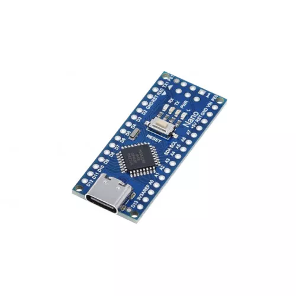

# Arduino Nano USB-C

Code snippets for Arduino Nano USB Type C.

<picture>
  
</picture>

### Examples:
- [Arduino Nano USB-C with LED](nano-led.ino)
- [Arduino Nano USB-C with LCD I2C Screen 20X4](nano-lcd.ino)
- [Arduino Nano USB-C with LED and LCD I2C Screen 20X4](nano_lcd_led.ino)

Watch the implementation of this code on our [YouTube channel](https://www.youtube.com/@Roboticxps)

To get your own Arduino Nano USB-C, visit our online store: (Product Page)

* Arduino Nano v3, USB-C (Soldered)
https://roboticx.ps/product/arduino-nano-v3-usb-c-clone-soldered/

* Arduino Nano v3, USB-C (Unsoldered):
https://roboticx.ps/product/arduino-nano-v3-usb-c-clone-unsoldered/

----

Follow us on social media:

* Facebook: https://www.facebook.com/Roboticxps
* Instagram: https://www.instagram.com/roboticx.ps
* YouTube: https://www.youtube.com/@Roboticxps
* LinkedIn: https://www.linkedin.com/company/roboticx
